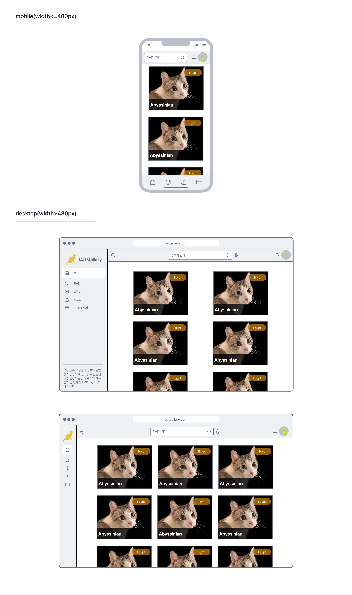

# Cat Gallery

## 개요 및 요구사항

`Cat Gallery`는 고양이 사진을 공유할 수 있는 커뮤니티 사이트이다. 과제는 아래의 [와이어 프레임](#디자인-와이어프레임)을 참조하여 동일한 페이지를 만들어야한다. 와이어 프레임을 제공하지만 와이어 프레임을 해치지 않는 선에서 세부적인 구현과 디자인은 구현 담당자에게 일임한다.

해당 과제는 **CSS FlexBox, Grid, 그리고 MediaQuery**를 활용한 레이아웃 연습을 주목적으로 한다.

또한, 스스로 프로젝트를 구축해보는 연습을 하기 위해 [아일랜드 아키텍처](https://jasonformat.com/islands-architecture/) 기반의 [MPA](https://docs.astro.build/ko/concepts/mpa-vs-spa/) 웹 프레임워크 [Astro](https://astro.build/)를 사용해 개발한다.

### 데이터 소스

고양이 정보를 가져오기 위해 [Cat API](https://thecatapi.com/)를 사용한다. 고양이의 사진 및 여러 정보가 담긴 데이터를 얻을 수 있는 RestFul API 서비스이므로 필요한 데이터를 얻을 수 있다. 홈페이지에 들어가 하단 `Pricing` 항목에서 `SIGNUP FOR FREE`를 클릭하면 자기 이메일을 입력하고 API 키를 받을 수 있다.

## 참조할만한 사이트

- [Astro 공식문서](https://docs.astro.build/ko/getting-started/)
- [A Complete Guide to Flexbox](https://css-tricks.com/snippets/css/a-guide-to-flexbox/)
- [A Complete Guide to CSS Grid](https://css-tricks.com/snippets/css/complete-guide-grid/)
- [Using media query](https://developer.mozilla.org/en-US/docs/Web/CSS/CSS_media_queries/Using_media_queries)
- [Google Fonts](https://fonts.google.com/icons) - 무료 폰트 및 아이콘을 구하기 좋다.

## 프로젝트 진행

담당자가 생성해주는 새 레포지토리에서 개발한다. 레포지토리 이름은 `fe-ojt-[이름]-catgallery`의 형식이며, 이름이 김철수면 `fe-ojt-kcs-catgallery`로 작성된다.

소스 관리는 `GitHub Flow` 워크플로우로 진행하고 작업이 완료된 모든 브랜치는 담당자의 허가하에 머지 된다.

## 디자인 와이어프레임

